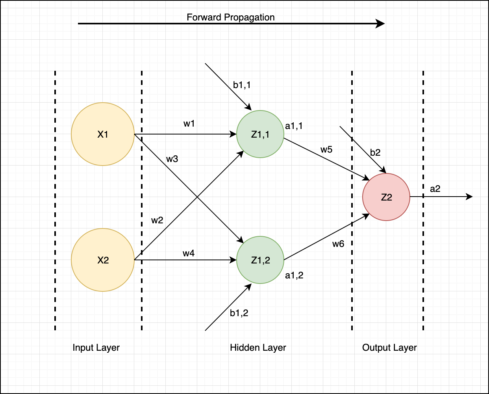
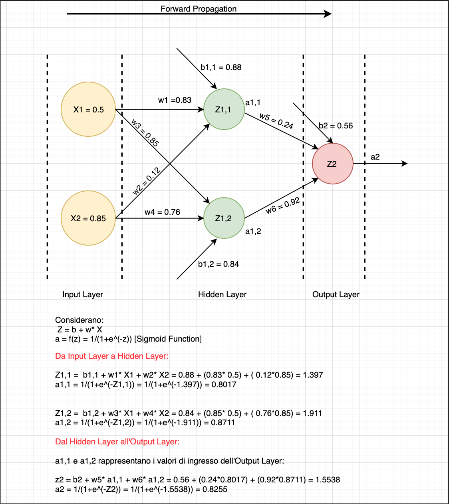
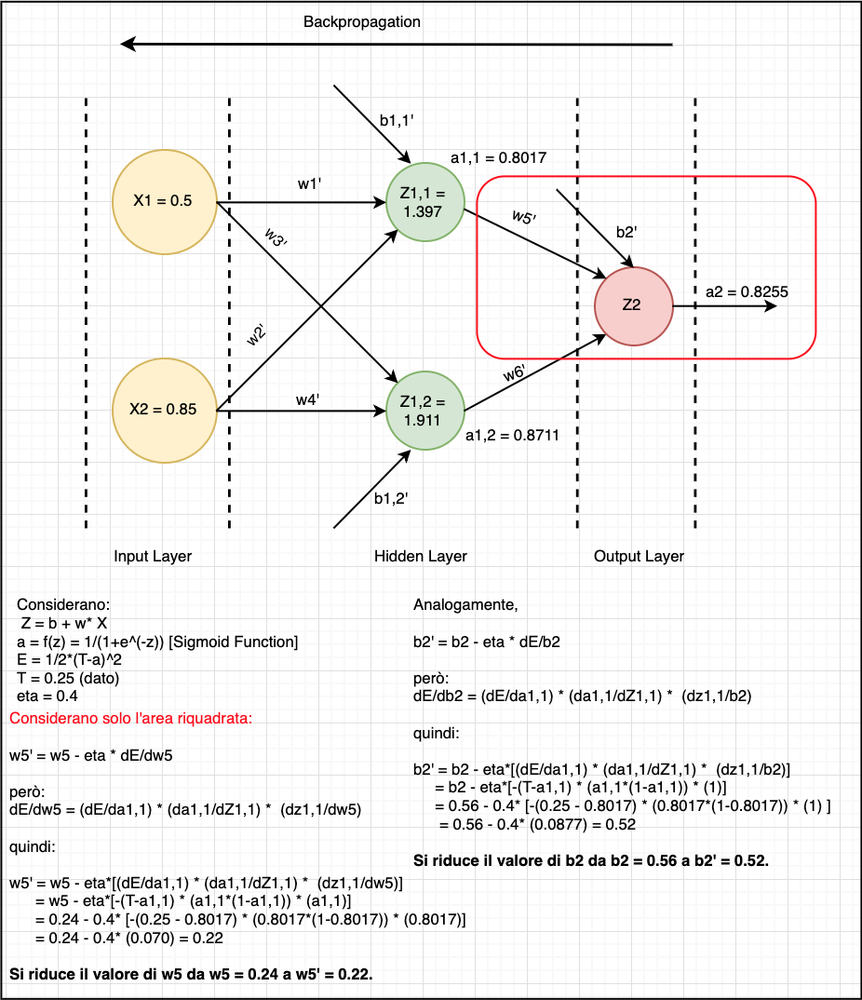
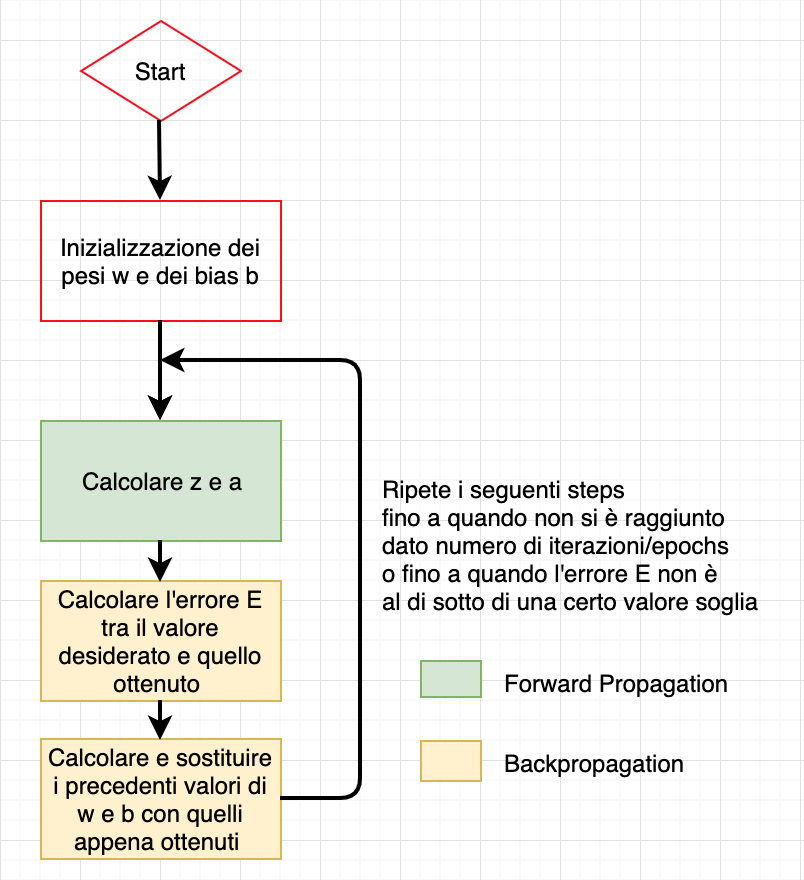

# **Deep Learning**

Il [Deep Learning][https://en.wikipedia.org/wiki/Deep_learning] è quella "branchia" dell'Intelligenza Artificiale (AI) e del Machine Learning (ML) basata su reti neurali artificiali.  Quest'ultime sono organizzata in strati e ciascun strato ha il compito di calcolare i valori necessari per lo strato successivo, affinchè l'informazione venga eleborata in maniera sempre più completa. A tal proposito, ci si avvale di algoritmi che "imparano" dai dati.

### **Applicazioni**

Tra le applicazioni del Deep Learing abbiamo:

- [Color Restoration](https://en.wikipedia.org/wiki/Colour_recovery) (processo in cui si "colorano" le immagini in B/N)
- [Speech Reenactment](https://www.youtube.com/watch?v=GwV1n8v_bpA) (processo in cui si sincronizza il movimento labbiale all'audio di un clip)
- [Automatic Handwriting Generation](https://www.cs.toronto.edu/~graves/handwriting.html) (processo in cui si riproduce la scritta a mano)
- [Object Classification and Detection in Image](https://medium.com/ai-techsystems/image-detection-recognition-and-image-classification-with-machine-learning-92226ea5f595) (processo in cui si classificano gli oggetti e si identificano le immagini)
- [Self-Driving Cars](https://en.wikipedia.org/wiki/Self-driving_car) (processo in cui la macchina si guida da sola)

### **Rete Neurale**

Una rete neurale artificiale nasce con l'obiettivo di imitare il compartamento del cervello umano, attraverso programmi o macchine. Come quello [biologico](https://it.wikipedia.org/wiki/Rete_neurale), anche quello artificiale è formato da:

- **assone** (che nella rete neurale artificiale rappresenta la linea di uscita dell'informazione dal nodo); 
- **soma** (che nella rete neurale artificiale rapprenta un nodo della rete) 
- **dendrite** (che nella rete neurale artificiale rappresenta la linea di entrata dell'informazione al nodo).

Come si può osservare [dall'immagine](https://it.wikipedia.org/wiki/Rete_neurale_artificiale#/media/File:Artificial_neural_network.svg), abbiamo 3 tipologie di strato (layer):

- **Input layer** (che è il primo strato della rete, da cui "partono" le informazioni e si propagano verso gli altri strati);
- **Hidden layer** (che rappresenta lo strato intermedio tra quello di input e quello di output. Per semplicità, nell'immagine ne è stata rappresentata una sola);
- **Output layer** (che rappresenta lo strato finale della rete da cui si estrapolano le informazioni eleborate dagli strati precedenti).

Dalla combinazione dei 3 strati, si possono ricavare archittetture differenti di reti neurali, in base alle necessità di studio (vedi immagine sotto, ricavata dal seguente [link](https://towardsdatascience.com/the-mostly-complete-chart-of-neural-networks-explained-3fb6f2367464)). 

In soldoni, le reti neurali sono strutture non-lineari di dati statistici organizzate come strumenti di modellazione. Esse possono essere utilizzate per simulare relazioni complesse tra ingressi ed uscite, che altre funzioni analitiche non riescono a rappresentare (source: [Wikipedia](https://it.wikipedia.org/wiki/Rete_neurale_artificiale)).

### **Algoritmi di Training e Activation Function**

Quando si lavora con le reti neurali, in genere, si parla di forward e back propagation e di activation function. La loro combinazione ci permette di ottenere un algoritmo di training completo. Prima di entrare nel dettaglio dell'algoritmo, andiamo ad analizzare i singoli attori:

- **forward propagation** (propagazione in avanti): è il processo attraverso cui le informazioni passano da un layer all'altro, seguendo la direzione naturale di propagazione: dall'input all'output (vedi immagine sotto). All'interno della rete, ogni dato ha un peso w. Un buon modo di processare le informazioni è quello di mappare la somma dei pesi, in uno spazio non lineare, attraverso una activation function (spegata di seguito).

  

  

  

  Ipotizzando di avere una rete neurale (come quella mostrata in figura), dove:

  - X: rappresenta il valore di ingresso della rete neurale artificiale;
  - Z : rappresenta il valore dei nodi per ciascun layer;
  - w: rappresenta il valore dei pesi che impattano sul ciascun nodo;
  - b: rappresenta il bias (valore costante non dipendente nè dall'input nè dall'output e che può essere pensato come un settaggio dell'activation function) che agisce su ciascun nodo;
  - a: rappresenta il valore in uscita da ciascun nodo.

  l'obiettivo è quello di calcolare il valore di a2. 

  Per comprendere meglio il concetto di Forward Propagation,  si analizza a livello numerico la rete neurale definata sopra, considerando:

  - Z come Z = b + (w * X) (per il primo livello di Hidden Layer dopo l'input layer) e  Z = b + (w * a) (per tutti gli altri livelli);
  - a come una sigmoid function a = 1/(1+e^(-z))

  A quel punto, si procede a calcolare il valore di a2, come segue, vedi figura.

  

- **backpropagation** (retropropagazione) è un algoritmo per l'allenamento di reti neurali artificiali supervisionate, attraverso cui si cerca di minimizzare il gradiente di perdita della funzione (andando ad aggiustare in modo iterativo i pesi w e i bias b tra le varie connessioni di un rete), [al fine di minimizzare la differenza tra il risultato ottenuto e quello desiderato](https://www.nature.com/articles/323533a0). 

  Anche qui, per consolidare il concetto, ho riportato un esempio. Considerando l'errore di un singolo nodo come Ei = 1/2*(Ti-ai)^2 (dove Ti è il valore desiderato e ai è il risultato ottenuto), i pesi w' e i bias b' possono essere calcolati come: w' = w - eta * (dE/dw) (dove eta è il **learning rate - velocità di apprendimento** e dE/dw è la derivata parziale dell'errore rispetto al parametro w) e b' = b - eta*(dE/db) (dove eta è il learning rate - velocità di apprendimento e dE/dw è la derivata parziale dell'errore rispetto al parametro b). Utilizzando i dati di w5 e b2 calcolati con il forward propagation e considerando T = 0.25 ed eta = 0.4, si procede al calcolo dei pesi e dei bias come segue (vedi figura).

  

  

  

- **activation function** è una funzione di attivazione dei nodi che gioca un ruolo fondamentale per il processo di apprendimento di una rete neurale e la scelta sbagliata della funzione può causare degli effetti di **Vanishing Gradient**, che porta alla scomparsa del gradiente di errore nel backpropagation. Tale effetto crea un apprendimento differenziato tra le zone vicino all'output (in cui gli hidden layers apprendono molto bene) e le zone vicino all'input (in cui gli hidden layers non apprendono). Nel Sigmoid function e nell'Hyperbolic Tangent Function, tale fenomeno è presente quando il valore di z cade fuori da un dato intervallo, in cui il gradiente della funzione è nullo. Per bypassare tale problema, si può ricorrere al ReLU function, che non attiva contemporaneamente tutti i nodi della rete allo stesso tempo. Infatti, quando z cade nell'intervallo dei numeri negativi, il valore di a = 0 e il nodo non si attiva.  

  

  Tra le activation function abbiamo:

  1. Binary step function;
  2. Linear function;
  3. Sigmoid function;
  4. Hyperbolic Tangent Function;
  5. Rectified Linear Unit (ReLU);
  6. Leaky ReLU;
  7. Softmax function.

  Le più popolari sono: 3. Sigmoid function, 4. Hyperbolic Tangent Function, 5. Rectified Linear Unit (ReLU) e la 7. Softmax function. Il loro andamento è visibile al seguente [link](https://en.wikipedia.org/wiki/Activation_function).

Come suddetto, la loro combinazione ci permette di ottenere un' algoritmo di training completo, definito come segue:

### **Librerie del Deep Learning**

Le librerie più popolari del Deep Learning sono:

- **Keras:** grazie alla sintassi molto semplice, è perfetta per chi vuole avvicinarsi al campo del Deep Learning o per chi vuole creare dei modelli molto semplici e rapidi da analizzare, in quando API di alto livello. Però, per utilizzarla, bisogna installare TensorFlow come backend.
- **TensorFlow:** rispetto a Keras, TensorFlow è una libreria di basso, che permette di avere più controllo (ed una maggiore comprensione) dei nodi o dei layers della rete. 
- **PyTorch:** è equivalente a TensorFlow, ma gli algoritmi girano sulla GPU ([unità di elaborazione grafica](https://it.wikipedia.org/wiki/Graphics_processing_unit)). E' molto diffuso in campo accademico (ricerca) e viene utilizzato per ottimizzare le espressioni dei custom. Sia TensorFlow che PyTorch non sono semplici da utilizzare come Keras.

